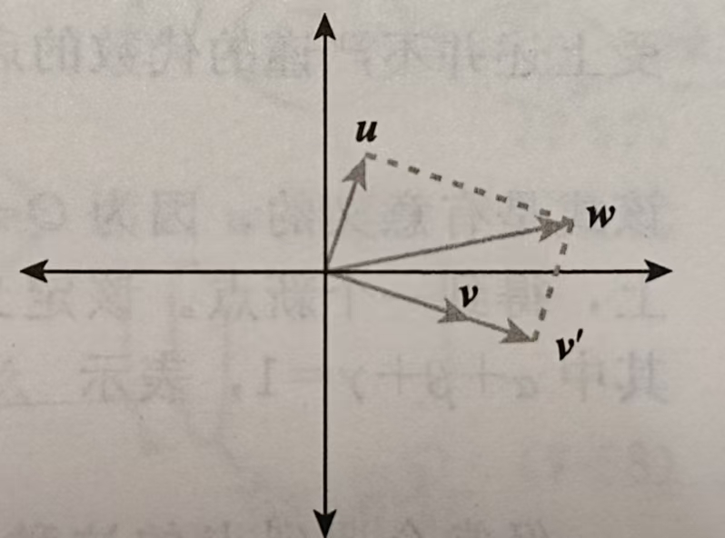

### 叉积 (Cross multiplication)
- 3D 空间中叉积的基本定义是：
$$
\begin{bmatrix}
v_x \\
v_y \\
v_z
\end{bmatrix} \times 
\begin{bmatrix}
w_x \\
w_y \\
w_z
\end{bmatrix} =
\begin{bmatrix}
v_y w_z-v_z w_y \\
v_z w_z-v_x w_z \\
v_x w_y-v_y w_x
\end{bmatrix}
$$

- 叉积是 **反交换** 的，即：$ v \times w = -w \times v$
- 叉积在加法和标量乘法上满足分配律，但不满足结合律
    - 即：$a \times (b + c) = a \times b + a \times c$
    - 与 $(a+b) \times c = a \times c + b \times c$
- 叉积的几何意义可以根据右手定则来理解：
    - 先让右手小指指向叉积的第一个参数向量 $v$ 相同的方向
    - 之后弯曲 $ 90\degree$，让小指指向第二个向量 $w$
    - 此时大拇指将指向第三个向量的方向（也就是结果向量的方向）
#### 推广一下叉积的几何意义：
- 一般地，在一个 $n$ 维空间中，$n-1$ 个向量 $v_1, ..., v_{n-1}$ 的叉积 $z$ 将位于垂直于包含 $v_1, ..., v_{n-1}$ 的子空间的直线上，其长度等于 $(n-1)!$ 乘上一个 $(n-1)$ 维的类似棱锥体的体积，该棱锥体的顶点是原点和各向量 $v_i$ 的末端点。
- 一般地，叉积的模的定义为：
    - $||v \times w|| = ||v||||w|| \space |sin\theta|$，其中 $\theta$ 为 $v$ 和 $w$ 之间的夹角

### 点积 (Dot multiplication)
- 两个 $n$ 维空间中的向量 $v$ 和 $w$ 的点积定义为：$$v \cdot w = v_1w_1+v_2w_2+...+v_n w_n$$
- 有时也记为 $<v, w>$，通常称为内积 (inner product)。
- 基于定义，点积可以用来计算两个向量之间的角度。
    - 设 $v$ 和 $w$ 是单位向量，则它们之间的夹角 $\theta$ 满足：$$v \cdot w = cos(\theta)$$
- 使用最多的形式是：$$\theta = cos^{-1}\frac{v \cdot w}{||v|| ||w||}$$
- 从实际理解的角度，点积代表了两个向量 $v$ 和 $w$ 之间的相似程度：
    - 当 $v$ 与 $w$ 平行的时候，该函数取到最大的可能值（正数）
    - 当 $v$ 与 $w$ 方向相反时，该函数取到最小的可能值（负数）
    - 当 $v$ 与 $w$ 互相垂直，该函数取到零
#### 点积用于求投影（projection）
- 假设有下面的向量表达式：$$w = v'+u$$
    - 其中 $v'$ 平行于 $v$，$u$ 垂直于 $v$：
    
    - 我们想确定 $v'$ 的表示
    - 首先我们知道：$ v' = sv $，其中 $s$ 是一个标量
    - 故有：$ v \cdot w = u \cdot v' + v \cdot u = v \cdot (sv) + 0 = s(v \cdot v)$
    - 所以 $$ s = \frac{v \cdot w}{v \cdot v} v $$
    - 当 $v$ 是单位向量时，$v'$ 可以简化为：$$v' = (v \cdot w)v$$